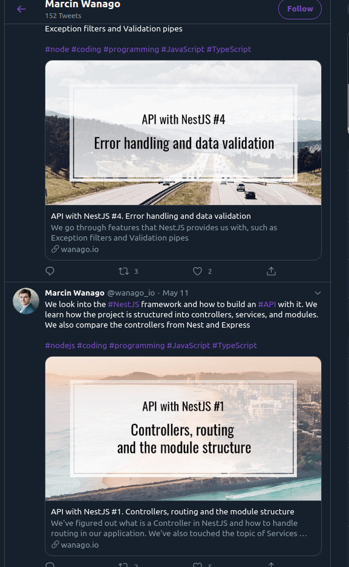

# Stencilbot

Stencilbot is a project that aims to help with the repetitive task of creating social media preview images, i.e. `twitter:image`, `og:image`, youtube video thumbnails, blog header images, etc.

