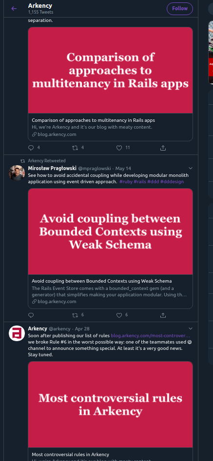
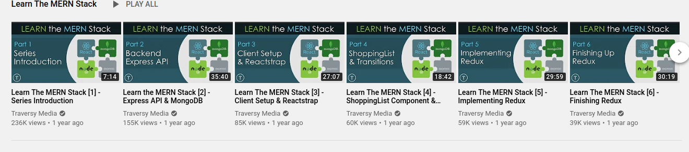

# Stencilbot

Stencilbot is a project that aims to help with the repetitive task of creating social media preview images, i.e. `twitter:image`, `og:image`, youtube video thumbnails, blog header images, etc.

Often those images are following some pattern, e.g.

The same background, different text:



The same background, different title and subtitle:



## Development

```bash
npm install
npx lerna bootstrap

npm run dev # local dev server, go to localhost:3000
```

```bash
npm run test
```
